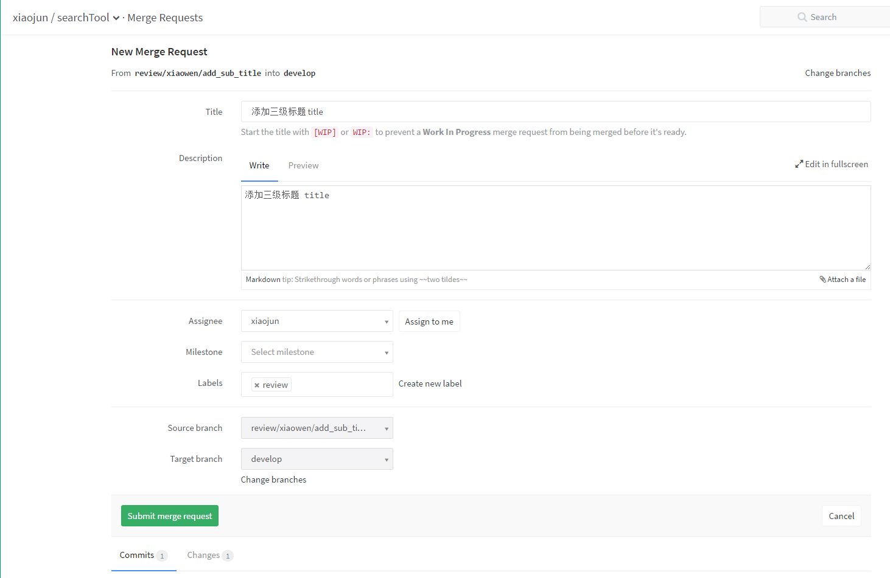
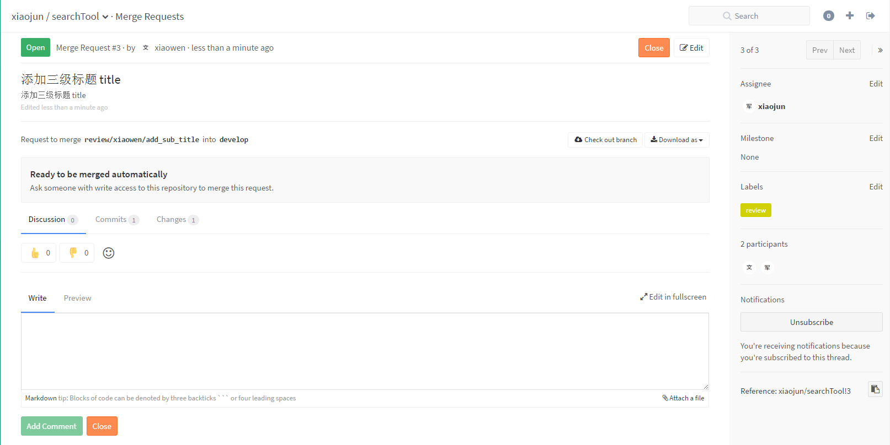
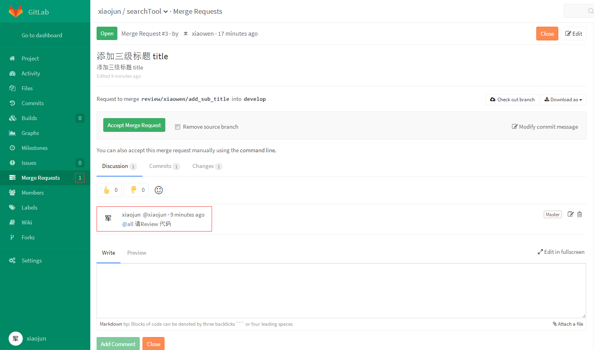
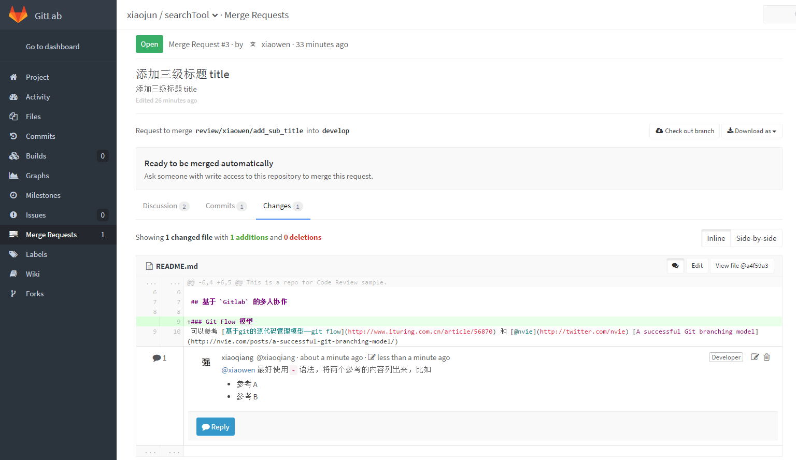
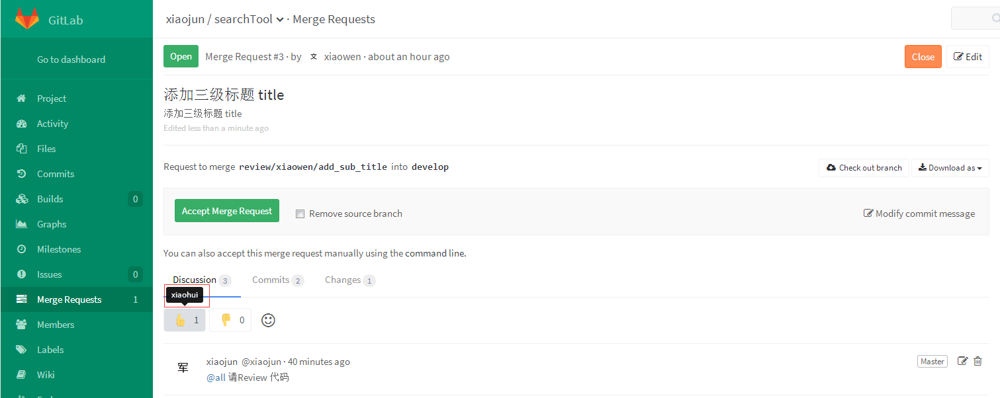
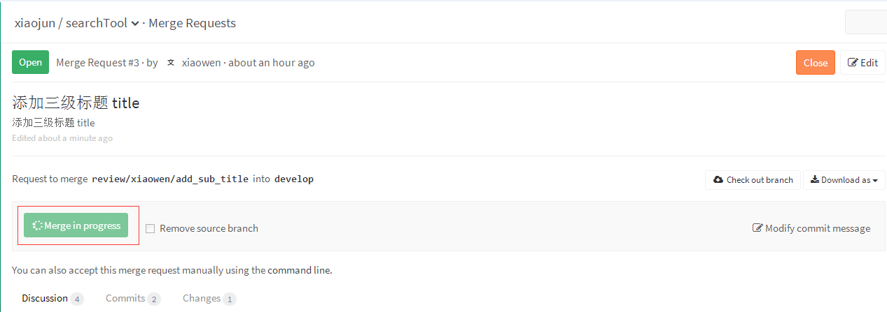

# Git Flow & Gitlab based Code Review

基于 `Gitlab` 的多人协作

## Git Flow 模型
说明：

- 本章节参考 [基于git的源代码管理模型——git flow](http://www.ituring.com.cn/article/56870) 和 [@nvie](http://twitter.com/nvie) [A successful Git branching model](http://nvie.com/posts/a-successful-git-branching-model/)
- 本章所有的图片引用都来源于 [@nvie](http://twitter.com/nvie) [A successful Git branching model](http://nvie.com/posts/a-successful-git-branching-model/)

> Git Flow是构建在Git之上的一个组织软件开发活动的模型，是在Git之上构建的一项软件开发最佳实践。

Git Flow重点解决的是由于源代码在开发过程中的各种冲突导致开发活动混乱的问题。

### 1 张模型图
Git Flow 模型全貌图

### 2 个主分支

- `master`
	稳定分支，在其上的代码都是可立即部署的生产代码

- `develop`
	开发分支，又叫做集成分支(`integration branch`), 是每日构建的分支。每日构建是连续集成的一个最佳实践,它要求每天至少构建软件一次。

### 3 种辅助分支
- `feature` 功能分支

	"生"是`develop`的人, "死"是`develop`的鬼

	

- `release` 测试分支

	"生"自`develop`, "归"于`develop` 和 `master`

	
	
	
- `hotfix` 生产 bug 修复分支

	"生"自`master`, 归于 `master` 和 `develop`

	

### 举个例子

小强和小文在维护同一个项目，他俩目前正在开发 1.2 版本的需求，这个时候，他们两个人收到了测试同学的邮件，说正在测试的 1.1 版本有问题，需要修复，bug 详情在 jira 上。 同时收到了PM 的反馈，说线上 1.0 版本有 bug, 需要紧急修复，上线。

于是，小强和小文商量了一下，由小强进行 1.1 提测版本的修复，小文进行 1.0 线上bug 的修复。

#### 小强的工作步骤：
- 将手头上的 1.2 相关需求代码进行提交到 `feature/xiaoqiang/1.2` 上
- 切换到 `release/1.1` 去准备修bug
- 修复完 bug 后，自测完成后，将代码提交到 `release/1.1` 中
- 同时将`release/1.1`的代码合并到`develop` 中
- fetch 远端的 `release/1.1` 和 `develop` 分支 merge 到本地的相应分支(使用 `--rebase`子命令)
- 将`release/1.1` 和 `develop` 的代码 push 到远程仓库
- 通知测试同学进行bug 验证。
- 切回到 `feature/xiaoqiang/1.2` 进行 1.2 的需求开发

#### 小文的工作步骤
- 将手头上的 1.2 相关需求代码进行提交到 `feature/xiaowen/1.2` 上
- 切换到 `master` 上（由于 master 是最近的发布版本，所以切换到 master 就是线上的代码）
- 基于 `master` 开一个 `hotfix/1.0` 分支, 在这上面进行修复线上问题
- 修复完成后，自测通过后，将代码提交，并让测试同学进行测试
- 测试完成后，合并到 `master` 分支，打 `1.0.1` 的 `tag`
- 将 `hotfix/1.0`分支合并到 `develop` 上
- fetch 远端的 `develop` 分支 merge 到本地的`develop`分支(使用 `--rebase`子命令)
- 将 `master` 和 `develop` push 到远程仓库
- 通知 测试同学进行 `1.0.1` 版本的发布
- 删除本地的 `hotfix/1.0` 分支（因为其的生命周期已经结束）
- 切回到 `feature/xiaowen/1.2` 进行 1.2 的需求开发

最后附上 Git Flow 高清无码大图 [下载地址](http://github.com/downloads/nvie/gitflow/Git-branching-model-src.key.zip)（可以将其打印出来，以便随时查看）。 

## 利用 GitLab 进行 Code Review

为了达到 Code Review 的目的，我们将Git Flow 的 两个主分支：`develop` 和 `master` 设置为受保护的（protected）分支，这样非项目Owner 若要将代码提交到 `protected` 的分支上，就必须要使用 GitLab 的 `Merge Request` 功能，我们的 Code Review 就是基于这个功能实现的。

### 创建 Merge request
创建 Merge Request 是通过 Gitlab 平台进行的，前提就是要将待合并的分支推送到 Gitlab 服务器上。 我们知道，普通开发者要 push 代码到 `protected` 分支是被拒绝的。 这样就存在一个问题，普通开发者如何创建 Merge Request?

针对上述问题，有两个方法可以解决，分别是 `开临时分支`和 `fork 项目`。

#### 开临时分支
通过辅助分支，将代码提交到 GitLab 上，然后使用 `Merge Request` 将其合并到 `protected` 的分支，然后在 Code Review 通过并执行 merge 之后，将临时分支删除就可以了。

##### 举个例子
拥有普通开发者权限的 小文 在完成 `feature/add_sub_title` 分支后，将其合并到 `develop` （也许需要解决可能存在的冲突）。这个时候，他是无法 push `develop` 分支的，因为没有权限。

于是，小文基于 `develop` 分支创建一个新的 review 分支 `review/xiaowen/add_sub_title`，推送到远端，然后通过 Gitlab 后台创建 Merge Request （`review/xiaowen/add_sub_title` => `develop`）。

在小文提交了 Merge Request 后，小军作为项目 Owner，通过邮件看到了小文的 Merge Request，于是就开始进入 Code Review 流程。

1. 选择待审核的分支

	

2. 编辑信息
	
	

3. 创建完成

	

#### Fork 项目
通过 fork 项目的方式在 Github 上用的比较多，大家可以自己了解一下 [Github flow](https://guides.github.com/introduction/flow/)

### Code Review
在 Code Review 中如果只有 Owner 一个人 Review，往往会出现遗漏，所以至少应该两个人（这里说的是至少3个人 的项目）。那么问题来了，在 Gitlab 中往往只有被提交者指定的人才能收到 Merge Request 的邮件，但是只有 Owner 才能 Merge 代码，那么如何让其他人参与 Review 呢？

#### 多人 Review 规则
根据 Gitlab 的功能，我们规定 Merge Requset 的接收者必须指定 项目的 Owner， Owner 在收到 Merge Request 后，可以指定项目中的成员进行 Review 代码，具体的流程为： 

- Owner 在 Merge Request 中添加一条评论，使用`@`符号，指定特定的成员（也可以使用 `@all` 指定项目中的所有成员），指定的人就可以收到邮件，去后台 Review 代码了

	- 项目 Owner 指定成员进行 Review
	
		

	- 项目 成员 接到通知进行 Review
	
		

- 被指定的成员，查看待Review 的代码，如果代码符合逻辑和遵循 Code Style，那么你可以点击`赞`的符号进行通过，否则，你在代码中添加评论，说明代码中不符合规范的地方，创建 Merge Request 的成员即可收到邮件，对代码进行相应的修改

	- Reviewer 对 Code 进行 Review，并评论

		

	- Reviewer 对 Code 进行点`赞`，表示通过

		

- Merge Request 的创建者修改完代码后，Merge Request 就有了记录，继续 Review 流程

	

- 项目 Owner 是否 Merge 的依据就是 `赞` 的个数。`赞`的人多了，离 Merge 就不远了

	- 这个 Merge Request 收集到了 2 个赞
		
		

	- Owner 决定通过 Review，进行 合并

		
	
	- 合并完成后，就可以将 `review` 分支删掉了, 或者可以点击 Revert 进行回滚。

		

- 查看 Merge Request 的状态

	

	

## 相关阅读
[让 Code Review成为一种习惯](http://mobile.51cto.com/aprogram-472272.htm)

