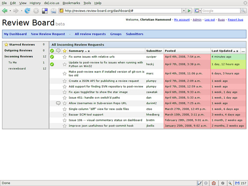
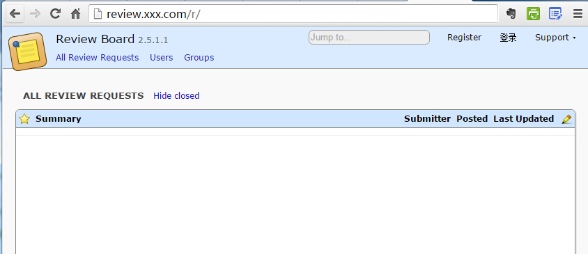

# Ubuntu SVN Apache ReviewBoard 配置 (一) 

> Ubuntu 搭建 ReviewBoard

[ReviewBoard 介绍，引用来自 【Review Board 2.0.9 发布，代码评审工具】](http://www.oschina.net/news/56376/review-board-2-0-9?utm_source=tuicool) 

>Review Board 它基于Django，你可以把它安装在自己的服务器上，工作流和Rietveld极为类似。令人高兴的是它提 供了在diffs里进行语法彩色编码，使得代码阅读变得简便。此外，它还实现了基于Lucene的搜索来帮助管理较大的diffs组。

>Review Board在审查补丁（Patch）方面表现完美。一个叫做“提交审查”的工具被用来和SCM系统进行连接（当前支持SVN、CVS、Perforce、Git和Mercurial等），可以允许你请求一个将被提交的修改的审查。用户基础页面将这个过程描述如下：

>1. 你在本地检出的代码上做了些可怕的修改。
- 你通过公布diff、编写描述和选择一些审查者来创建一个审查请求。
- 你在审查请求中点击“发布”并等待你的审查者看到它。
- 其他人看了你的审查请求，说道“这太可怕了，除非什么东西坏掉了。”
- 你根据他们的评论更新了你的代码。
- 你公布了更新后的diff，以及对他们评论的解答以指明你修改了什么（或者你要说明为什么你不打算按照他们的建议修改代码）。
- 大家看了你更新后的代码，并请你继续。
- 你将修改提交到仓库中。
- 你在审查请求中点击“设置为已提交”来从其他人的面板中移除你的审查请求。

>

Install & Config 参考文章： [http://www.linuxidc.com/Linux/2014-05/101222.htm](http://www.linuxidc.com/Linux/2014-05/101222.htm)
## Install

-  `SVN` + `Apache` 安装，请看 `Ubuntu_svn_apache.md`

- C 编译工具安装

		$ apt-get install gcc

- 编译程序必须的软件包

		$ apt-get install build-essential autoconf libtool pkg-config

- 图片库安装
	
	Ubuntu Server 默认是没有该库的

		$ apt-get install libjpeg62-dev
		

- Python 环境安装
由于 `ReviewBoard` 是基于 `Python` 的 `esay_insall`，故先要安装。`easy_isntall` 这个是`python` 的自动安装工具，以后可以用 `easy_install+包名` 的方式安装。

		$ apt-get install python python-dev python-setuptools

- 安装 Apache 的 Python 模块

		$ apt-get install libapache2-mod-python
		$ a2enmod python # 修改 Apache 的配置，让 python-mod 处于 enable 状态

- 安装 Mysql

		$ apt-get install mysql-server python-mysqldb

- 安装 memcached

	ReviewBoard 需要 memcached 的支持

		$ easy_install libmemcache-dev python-memcached

- 安装 mod-wsgi 模块
	
	mod_wsgi 是支持webpy的一个模块

		$ apt-get install libapache2-mod-wsgi

	ps: 如果apache 启动不起来，那就说明 python 和 wsgi 的版本不对, 那么执行如下操作
		
		$ apt-get remove libapache2-mod-python libapache2-mod-wsgi
		$ apt-get build-dep libapache2-mod-python libapache2-mod-wsgi

	查看mod_wsgi是否安装成功，找文件`/usr/lib/apache2/modules/mod_wsgi.so`
	
- 安装 Path

	RviewBoard 的 diff 需要 patch 支持

		$ apt-get install patch

- 安装 ReviewBoard

	安装之前需要先确保机器安装了以下依赖库，否则中途会失败

		$ apt-get install zlib1g-dev

	开始安装 ReviewBoard

		$ easy_install ReviewBoard
	恩，这是一个漫长的过程 ~~~

- 安装 Python 和 Perforce 的绑定

		$ curl http://reviewboard.googlecode.com/svn/trunk/P4PythonInstaller/setup.py > setup.py
	结束后会在 当前目录下生成一个 `setup.py` 文件, 用 Python 运行它

		$ python setup.py

	oops!如果安装失败出现如下错误

		Unsupported Linux version: xxx  linuxver 
	我的服务器是 `Ubuntu Server 15.10 (Linux ubuntu 4.2.0-16-generic)`那就绕过版本检测即可
	
		# 第 102 行: 
		if linuxver.startswith('2.6') or linuxver.startswith('3.')：
		# 改为 => 
		if linuxver.startswith('2.6') or linuxver.startswith('3.') or linuxver.startswith('4.')：

	再运行执行一次 `setup.py`脚本
		

- 安装 Database Bindings

		$ apt-get install libmysqlclient-dev
		$ easy_install mysql-python

- 安装 RBTools

		$ easy_install -U RBTools

- 安装 Amazon S3 Support（可选）**需要付费**
	 
	*ReviewBoard 通过其上传截图*

		$ easy_install django-storages

- 安装 OpenStack Swift （可选）

	*ReviewBoard 通过其上传存储文件*

		$ easy_install django-storage-swift

 
## Config

### 配置 Mysql 数据库
参考资料 [http://my.oschina.net/u/1179414/blog/202377](http://my.oschina.net/u/1179414/blog/202377)

- 设置 Mysql 字符集编码 `utf-8`

	[Switch to UTF-8 charset in Mysql on Ubuntu](http://www.tuicool.com/articles/y67RN3)

- 使用 root 用户进入 Mysql 命令行

		$ mysql -uroot -pxxx # 使用你的root 用户登录

- 创建 reviewboard 数据库
	
		mysql> CREATE DATABASE reviewboard;

- 添加 reviewboard 访问用户 `review` 并授权

		# 创建: CREATE USER 'username'@'host' IDENTIFIED BY 'password';
		mysql> CREATE USER 'review'@'%' IDENTIFIED BY '12345678';
		
		# 授权: GRANT privileges ON databasename.tablename TO 'username'@'host'
		mysql> GRANT all ON reviewboard.* TO 'review'@'%';

- 刷新数据库

		mysql> flush privileges;

### 配置 Reviewboard

- 创建 Reviewboard 站点

		$ rb-site install /var/www/reviewboard
	
		Domain Name: Domain Name: review.xxx.com
		Root Path [/]： /

		Database Type: 1
		Database Name [reviewboard]: reviewboard
		Database Server [localhost]: localhost
	    Database Username: review
		Database Password: 
		Confirm Database Password:
	
		Memcache Server [localhost:11211]: 
	
		Username [admin]:
		Password: 
		Confirm Password: 
		E-Mail Address:
		Company/Organization Name (optional): 
	
		Allow us to collect support data? [Y/n]: Y
	
		-----------
	
		* The site has been installed	
		* You need to modify the ownership of the following directories and
	    * their contents to be owned by the web server:
			* /var/www/reviewboard/htdocs/media/uploaded
	        * /var/www/reviewboard/htdocs/media/ext
	        * /var/www/reviewboard/htdocs/static/ext
	        * /var/www/reviewboard/data

	OK 站点创建完成，然后就是修改目录的相关权限

		$ chown -R www-data /var/www/reviewboard/htdocs/media/uploaded
		$ chown -R www-data /var/www/reviewboard/htdocs/media/ext 
		$ chown -R www-data /var/www/reviewboard/htdocs/static/ext  
		$ chown -R www-data /var/www/reviewboard/data 

- 在 Apache2 中配置

		$ cd /etc/apache2/sites-available
		$ cp /var/www/reviewboard/conf/apache-wsgi.conf reviewboard.conf
		$ cd ../sites-enabled
		$ ln -s ../sites-available/reviewboard.conf
		$ /etc/init.d/apache2 restart

- 配置 hosts

		$ vi /etc/hosts

		--- hosts 文件

			# 在最后加上映射
			localhost review.xxx.com

		--- 保存并关闭 hosts

- 测试访问

	- 浏览器中输入 review.xxx.com
	
		

	- 命令行 curl

			$ curl http://review.xxx.com/r/ | grep review
			  % Total    % Received % Xferd  Average Speed   Time    Time     Time  Current
			                                 Dload  Upload   Total   Spent    Left  Speed
			        MANUAL_URL = 'https://www.reviewboard.org/docs/manual/2.5/',
			 <li><a href="https://www.reviewboard.org/docs/manual/2.5/"> Docs</a></li>
			   <li><a href="https://www.reviewboard.org/docs/manual/2.5/">Documentation</a></li>

	

	

		

